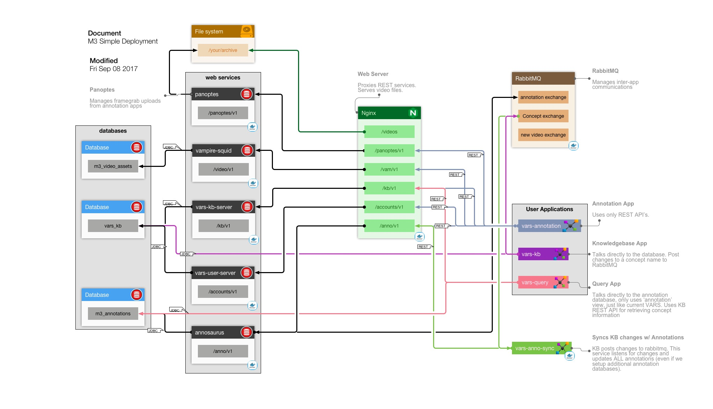

# MBARI Media Management (M3)

This documentation is for MBARI's Media Management system. Used by MBARI for tracking and annotating video files.

## Overview

If this diagram causes a `WTF?` moment, you may want to read '[The non-techie's guide to servers](https://hackernoon.com/the-non-techies-guide-to-servers-af1fa3dbf7d8)'

